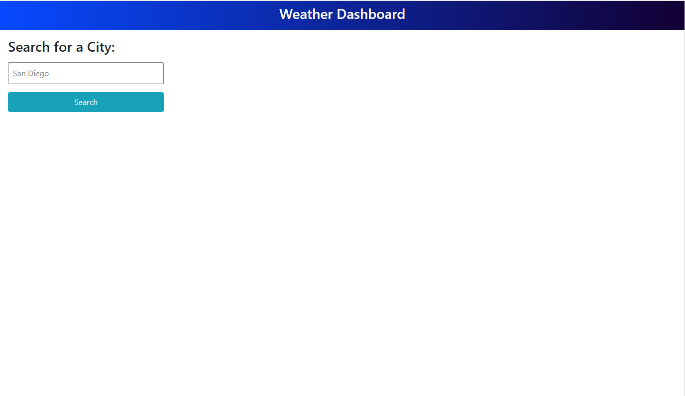
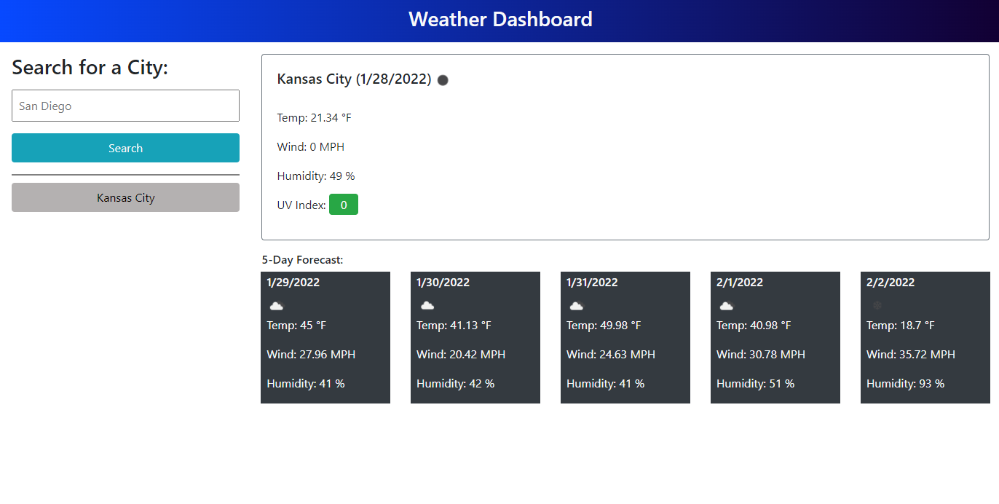
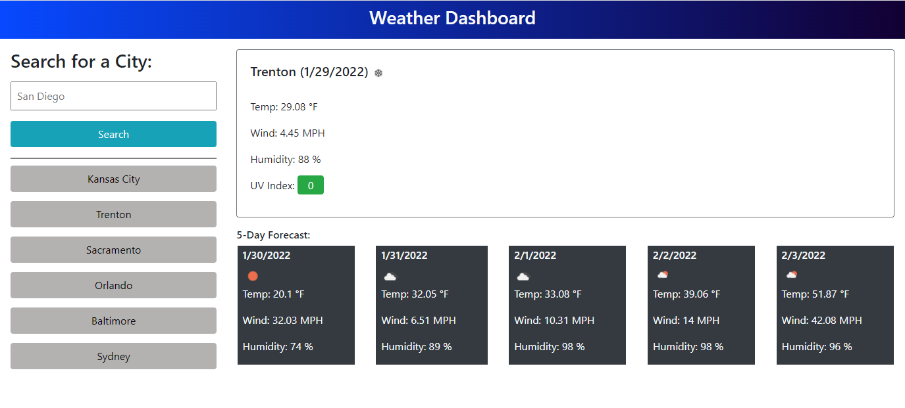
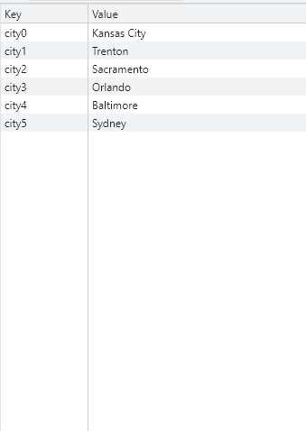
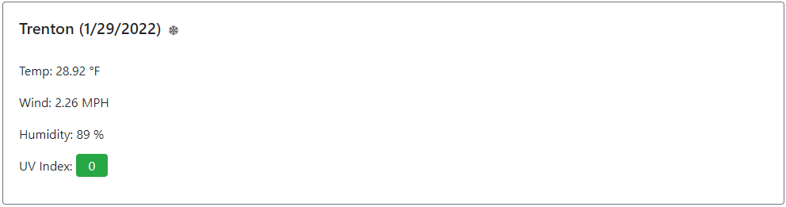
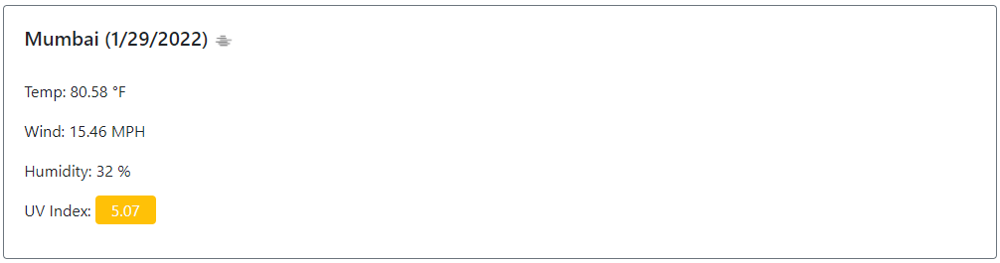
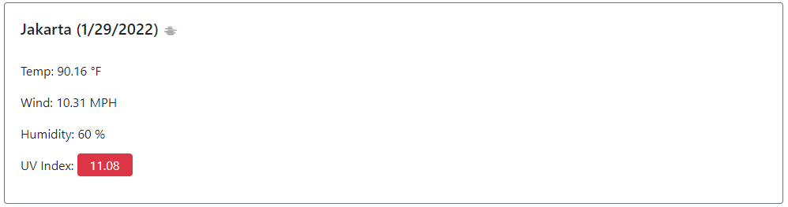

# Weather Dashboard

## Purpose
A weather dashboard that allows you to see the current and future weather conditions and creates a search history for multiple cities using Open Weather Map API

## Built with 
* Open Weather Map API
* BootStrap
* Open Iconic
* Google Fonts
* JavaScript
* HTML
* CSS

## Website
https://ajmarrocco.github.io/ajm-weather-dashboard/

## Images with Descriptions

### Displays Homepage

 

### Weather for one city

### Weather for mulitple cities

### Local Storage

### Favorable UVI Index

### Moderate UVI Index

### Severe UVI Index

## Contribution
Made by Anthony Marrocco

### &copy; Anthony Marrocco